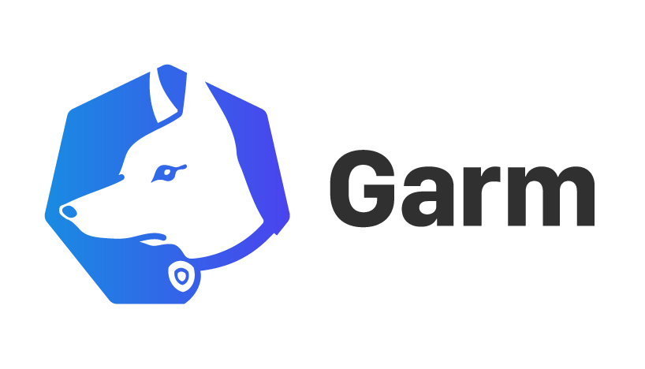
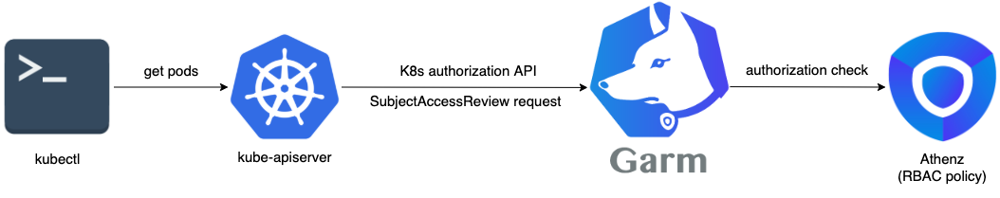

# Garm

[](https://opensource.org/licenses/Apache-2.0)
[](https://github.com/AthenZ/garm/releases/latest)
[](https://hub.docker.com/r/athenz/garm/tags)
[](https://goreportcard.com/report/github.com/AthenZ/garm)
[](http://godoc.org/github.com/AthenZ/garm)
[](code_of_conduct.md)



<!-- TOC insertAnchor:false -->

- [What is Garm](#what-is-garm)
- [Use Case](#use-case)
    - [Authorization](#authorization)
    - [Docker](#docker)
    - [Usage](#usage)
- [Contributor License Agreement](#contributor-license-agreement)
- [About releases](#about-releases)

<!-- /TOC -->

## What is Garm



Garm implements the Kubernetes authorization webhook interface to provide access control on your K8s resources with [Athenz](https://github.com/AthenZ/athenz) RBAC policy. It allows flexible resource mapping from K8s resources to Athenz ones, mutli-tenancy, and black/white list.

By default, Garm replies the native Kubernetes authentication for authorization. However, it also supports the Kubernetes authentication webhook. Using the authentication hook requires Athenz to be able to sign tokens for users.

Requires go 1.18 or later.

## Use Case

### Authorization


1. K8s webhook request (SubjectAccessReview) ([Webhook Mode - Kubernetes](https://kubernetes.io/docs/reference/access-authn-authz/webhook/))
    - the K8s API server wants to know if the user is allowed to do the requested action
2. Athenz RBAC request ([Athenz](http://www.athenz.io/))
    - Athenz server contains the user authorization information for access control
    - ask Athenz server is the user action is allowed based on pre-configured policy

Garm convert the K8s request to Athenz request based on the mapping rules in `config.yaml` ([example](./config/testdata/example_config.yaml)).

- [Conversion logic](./docs/garm-functional-overview.md)
- [Config details](./docs/config-detail.md)

P.S. It is just a sample deployment solution above. Garm can work on any environment as long as it can access both the API server and the Athenz server.

### Docker
```shell
$ docker pull docker.io/athenz/garm
```

### Usage

- [install Garm](https://github.com/AthenZ/garm/blob/master/docs/installation/02.%20install-garm.md)
- [configure k8s webhook](https://github.com/AthenZ/garm/blob/master/docs/installation/03.%20config-k8s-in-webhook-mode.md)
- [configure Athenz & Garm yaml](./docs/config-detail.md)

## Contributor License Agreement

This project requires contributors to agree to a [Contributor License Agreement (CLA)](https://gist.github.com/ydnjp/3095832f100d5c3d2592).

Note that only for contributions to the garm repository on the [GitHub](https://github.com/AthenZ/garm), the contributors of them shall be deemed to have agreed to the CLA without individual written agreements.

## About releases

- Releases
    - [](https://github.com/AthenZ/garm/releases/latest)
    - [](https://hub.docker.com/r/athenz/garm/tags)
